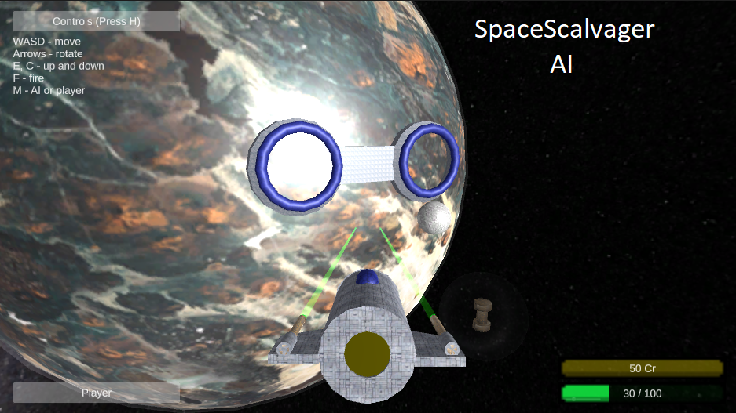

# SpaceScalvagerAI
Unity ML Agents Space Game Environemnt for training AI with Reinforcement Learning algorithms. 
The spaceship pilot want to make some credits by selling scalvaged minerals.
1. Find a meteor and destroy it.
2. Take mineral while cargo is not full.
3. Sell minerals on the planetary base.
4. Get your credits!

Project includes:
UnityML agents environment (SpaceScalvager)
Configs for training with ML Agents
Python scripts for training\exporting with RLLib - preferable. Need to build unity project as exe file.

The game:
https://swingshuffle.itch.io/spacescalvagerai

